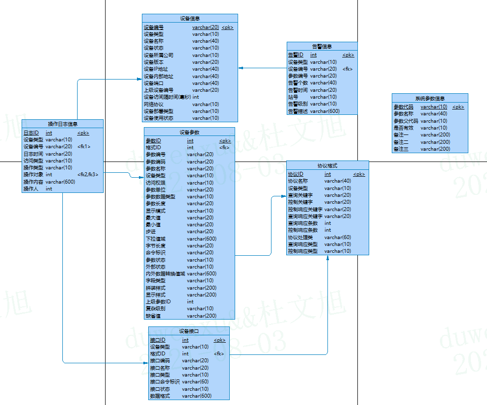

### 监控项目协议解析

#### 1.协议类型
- TCP
- UDP
- SNMP(simple network management protocol)

#### 2.数据库模型

> 设备接口：多参数的抽象
>
> 协议格式：各设备 查询/控制 请求/响应 的关键字以及各设备所对应的协议处理类配置

#### 3.协议解析

##### 3.1. 帧头信息处理

- 处理流程基础类：AbsDeviceSocketHandler

- 不同协议解析需要实现的部分：ProtocolPackService类中的两个方法

##### 3.2. 内容字节信息处理

- 三种类型的基础接口：

  * IParaPrtclAnalysisService: 单参数指令
  * IQueryInterPrtclAnalysisService：多参数查询/响应
  * ICtrlInterPrtclAnalysisService：多参数控制/响应
  
- 根据不同的帧传输协议格式做不同的实现

##### 3.3. 处理完成后的回调

- 数据信息处理后的回调操作：例如：推送数据、记录日志、上报信息等

